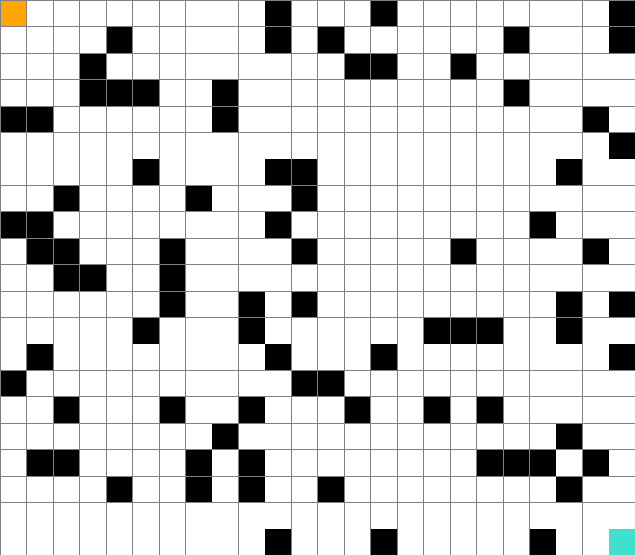
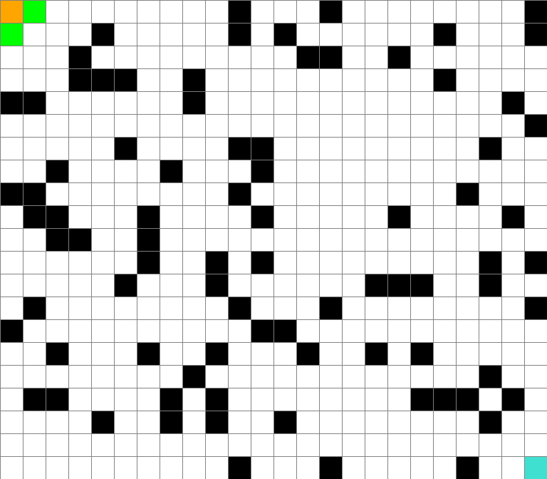

# maze-search-algorithm
Search algorithms to solve maze  
Inspired on Tech With Tim's Tutorial

## Solution to teacher's maze:
### How to run
Install the requirements, then run
```bash
python main.py
```

Press `l` to load teacher's map, then press `space` to solve the maze.
After solve the maze, it takes a little while to generate the solution's animation.
It saves as `solution.gif`.

The maze is solved using BFS as default, but you can change the algorithm.

### BFS


### A*

Using euclidian distance as heuristic

